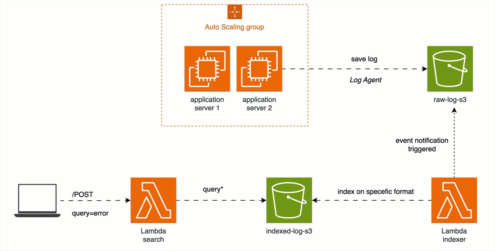
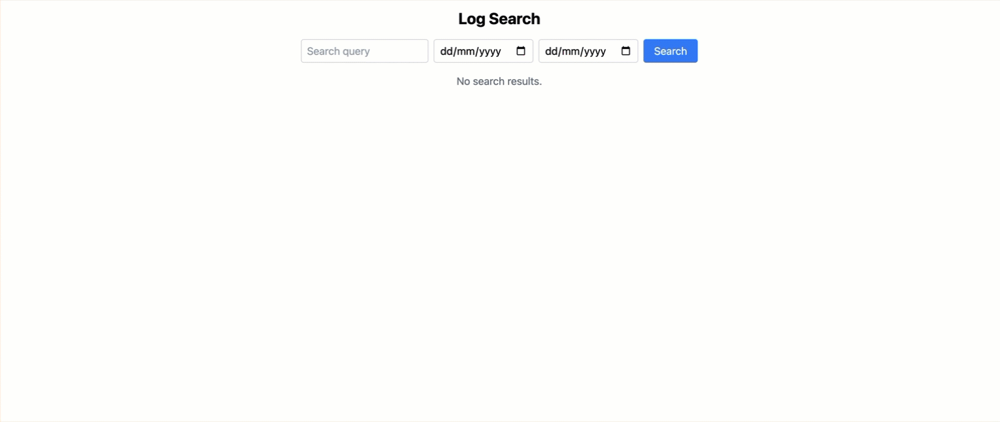

# Log search toolkit aws

The Log Search Toolkit AWS is a powerful and efficient solution for searching and analyzing log data stored in Amazon S3. It leverages AWS services such as Lambda, S3, and CDK to provide a scalable and serverless architecture for log processing and retrieval.

Key Features:
- Seamless log storage and indexing using Amazon S3 and Lambda
- Fast and efficient search API powered by AWS Lambda
- User-friendly frontend interface built with React and Tailwind CSS
- Easy deployment and management with AWS CDK

With the Log Search Toolkit AWS, you can quickly search through vast amounts of log data, filter results by date range, and highlight relevant information. It simplifies log analysis tasks and helps you gain valuable insights from your application logs.

## Structure

This demo consists of the following components:

- **Log Storage**: An Amazon S3 bucket is used to store the raw log files.
- **Log Indexing**: An AWS Lambda function is triggered whenever a new log file is uploaded to the S3 bucket. It indexes the log data and stores the indexed data in another S3 bucket.
- **Search API**: An AWS Lambda function serves as the search API. It receives search queries, retrieves the relevant indexed data from S3, and returns the search results.
- **Frontend**: A React application with Tailwind CSS provides a user-friendly interface for entering search queries and displaying the search results.

## Prerequisites

Before deploying the project, ensure you have the following:

- AWS CLI installed and configured with appropriate credentials.
- Node.js and npm (Node Package Manager) installed.
- AWS CDK installed globally (`npm install -g aws-cdk`).

## Deployment

To deploy the project using AWS CDK, follow these steps:

1. Clone the repository:
```sh
git clone <repo>
```
2. Install the project dependencies:
```sh
npm install
```
3. in ```package.json``` change myprofile to your local aws profile
4. Bootstrap the AWS environment (one-time setup) with .env:
```
npm run bootstrap
```
5. Deploy the project:
```
npm run deploy
```
## Frontend



inside the frontend directory,run:
```sh
npm install
npm run dev
```


## License

This project is licensed under the [MIT License](LICENSE).

